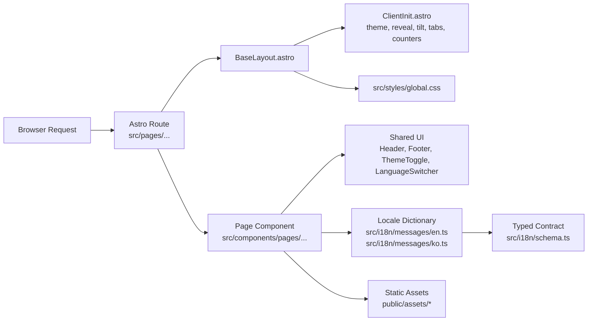
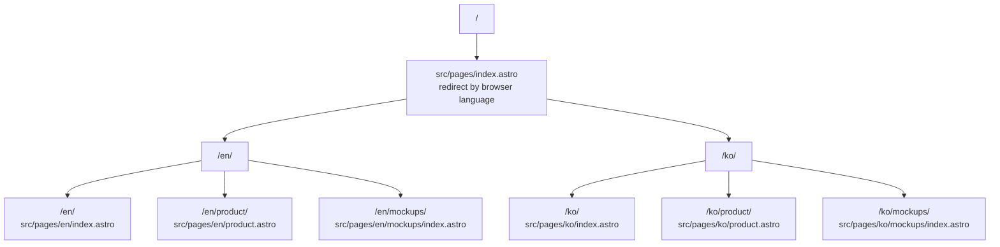
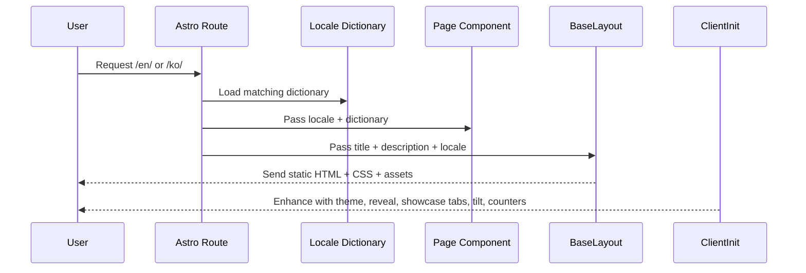
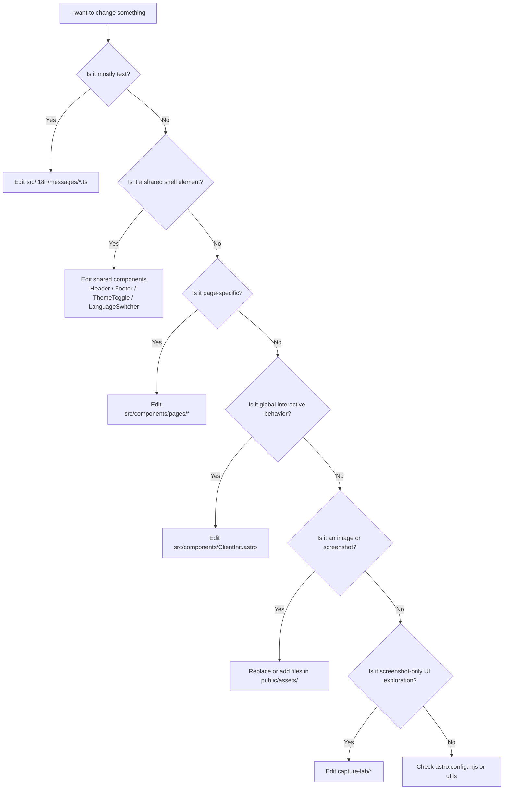
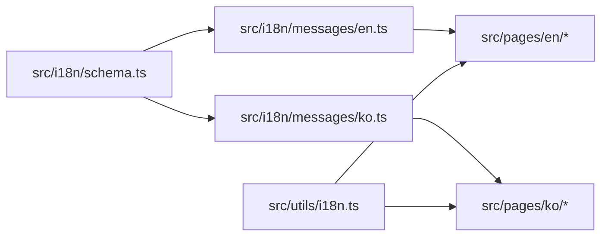

[Github Demo Page](https://2infinityn6eyond.github.io/DemoPage/en/)


# LogK Homepage Demo

Astro-based multilingual startup homepage for **LogK**, a product that helps users choose, delegate across, compare, and verify answers from multiple AI models.

This repository is designed to stay simple enough for a small team, while remaining clean and extensible as the homepage grows.

## What This Project Is

- A static Astro site suitable for GitHub Pages
- A bilingual marketing site with `en` and `ko` routes
- A design system with light and dark themes
- A homepage and product page built from reusable page components
- A detached `capture-lab/` used only to create screenshot-ready mockups that can later be imported as static assets

## Core Principles

These are the architectural rules that keep the project manageable:

1. **Routes stay thin.**
   Route files should mostly load a dictionary and render a page component.
2. **Marketing copy lives in dictionaries.**
   English and Korean text should stay under `src/i18n/messages/`.
3. **Page sections live in page components.**
   Large page composition belongs in `src/components/pages/`.
4. **Shared chrome stays shared.**
   Header, footer, theme toggle, locale switcher, and global client-side behavior live in shared components.
5. **Static assets are explicit.**
   Screenshots and decorative images live in `public/assets/`.
6. **Mockup generation is isolated.**
   Screenshot-only prototype pages live in `capture-lab/`, not in the Astro component tree.

## Tech Stack

| Layer | Choice | Why |
| --- | --- | --- |
| Site framework | Astro 5 | Static output, simple routing, strong fit for GitHub Pages |
| Styling | Global CSS | Fast to iterate for a landing page and easy to deploy |
| Language support | Astro i18n + typed dictionaries | Clean locale routing and controlled copy structure |
| Interactivity | Small client script in `ClientInit.astro` | Keeps the site mostly static while enabling polished motion |
| Visual mockups | Detached HTML/CSS/JS in `capture-lab/` | Lets you design screenshot assets without coupling them to Astro |

## Quick Start

### 1. Install dependencies

```bash
npm install
```

### 2. Run local development server

```bash
npm run dev
```

Default Astro dev URL:

```text
http://localhost:4321
```

### 3. Build the static site

```bash
npm run build
```

### 4. Preview the built output

```bash
npm run preview
```

### 5. Type-check and Astro-check the project

```bash
npm run check
```

## Environment Variables

The site is configured in [`astro.config.mjs`](./astro.config.mjs).

| Variable | Purpose | Example |
| --- | --- | --- |
| `SITE_URL` | Canonical production site URL | `https://logk.ai` |
| `BASE_PATH` | Subpath for GitHub Pages project deployments | `/PAGE_DEMO` |

### Example: local build with GitHub Pages-style base path

```bash
SITE_URL=https://username.github.io BASE_PATH=/PAGE_DEMO npm run build
```

## Project Map

```text
.
├── astro.config.mjs
├── package.json
├── public/
│   └── assets/                     # screenshots and decorative static assets
├── src/
│   ├── components/
│   │   ├── ClientInit.astro        # global client-side interactions
│   │   ├── Footer.astro
│   │   ├── Header.astro
│   │   ├── LanguageSwitcher.astro
│   │   ├── ThemeToggle.astro
│   │   ├── mockups/                # Astro-rendered visual mockups
│   │   └── pages/                  # page-level composition components
│   ├── i18n/
│   │   ├── messages/               # locale dictionaries
│   │   └── schema.ts               # typed dictionary contract
│   ├── layouts/
│   │   └── BaseLayout.astro        # fonts, metadata, transitions, theme bootstrap
│   ├── pages/
│   │   ├── index.astro             # locale redirect entry
│   │   ├── en/                     # English routes
│   │   └── ko/                     # Korean routes
│   ├── styles/
│   │   └── global.css              # global visual system and page styles
│   ├── utils/
│   │   └── i18n.ts                 # locale helpers
│   └── content.config.ts           # currently empty; no content collections active
├── capture-lab/                    # detached HTML mockup workspace for screenshots
└── README.md
```

## Architecture Overview



### Why This Matters

- You can change marketing copy without touching layout logic.
- You can redesign sections without changing route structure.
- You can replace screenshots without touching Astro internals.
- You can keep visual-only experimentation outside the main app tree.

## Route Structure

The project intentionally keeps route files minimal.



### Route Rule

If you add a new page, keep the route file small:

1. choose locale
2. load dictionary
3. render `BaseLayout`
4. render one page component

That pattern is already used by the current localized pages.

## Page Rendering Flow



## Responsibility Guide

When you want to change something, use this map:



## Directory Details

### `src/pages/`

Purpose: file-based routing.

Current rule:

- Keep these files thin.
- Do not put large UI markup here unless it is a tiny one-off route.
- Prefer page components under `src/components/pages/`.

### `src/components/pages/`

Purpose: page composition.

This is where large sections of the homepage and product page belong.

Examples:

- `HomePage.astro`
- `ProductPage.astro`
- `MockupsPage.astro`

This directory is the right place when you are building a new page or heavily redesigning an existing one.

### `src/components/`

Purpose: shared UI and site-wide behavior.

Examples:

- `Header.astro`
- `Footer.astro`
- `ThemeToggle.astro`
- `LanguageSwitcher.astro`
- `ClientInit.astro`

If a component appears across multiple pages, it belongs here rather than under `components/pages/`.

### `src/components/mockups/`

Purpose: Astro-rendered illustration/mockup components used inside the site itself.

This is different from `capture-lab/`.

- `src/components/mockups/` is part of the Astro app
- `capture-lab/` is not part of the Astro app

Use Astro mockup components when you want stylized in-page visuals.
Use `capture-lab/` when you want screenshot capture assets.

### `src/i18n/`

Purpose: locale management.

- `schema.ts` defines the typed contract for dictionaries.
- `messages/en.ts` and `messages/ko.ts` provide actual localized content.
- `messages/index.ts` resolves the correct dictionary for a locale.

This is one of the most important maintainability boundaries in the project.

### `src/layouts/`

Purpose: HTML shell, metadata, fonts, transitions, and global bootstrapping.

`BaseLayout.astro` is responsible for:

- `<html lang="...">`
- `<title>` and meta description
- canonical URL generation
- font loading
- Astro client router for smooth page transitions
- initial theme bootstrap before paint

### `src/utils/`

Purpose: small pure helpers.

Currently:

- `i18n.ts` handles locale helpers and localized path generation

Keep this directory for logic that should not live inside a component.

### `src/styles/`

Purpose: site-wide styling.

Current state:

- `global.css` contains the design system, section styles, responsive behavior, and theme variants.

Guideline:

- Keep tokens and shared utilities near the top.
- Keep section-level styles grouped by feature.
- If the site grows significantly, split this file into partials such as:
  - `tokens.css`
  - `layout.css`
  - `home.css`
  - `product.css`
  - `mockups.css`

That split is not required yet, but it is the next clean refactor if the stylesheet gets substantially larger.

### `public/assets/`

Purpose: immutable static assets served directly.

Examples:

- screenshot captures
- background graphics
- SVG accents

Use this directory for final assets that the Astro site should ship directly.

### `capture-lab/`

Purpose: detached visual-only mockup workspace.

This directory exists to create screenshot material without introducing experimental UI complexity into the Astro app.

Use it when:

- you want a realistic dashboard screenshot
- you want to experiment visually without touching production components
- you want to capture PNG assets and move them into `public/assets/`

Do not use it for:

- actual production routes
- shared navigation
- translated marketing copy
- persistent business logic

## Multilingual Structure

The project uses locale-prefixed routes and typed dictionaries.



### Add a New Language

If you later add a third locale such as Japanese:

1. Add the locale in `astro.config.mjs`
2. Add it to `src/i18n/schema.ts`
3. Create `src/i18n/messages/<locale>.ts`
4. Register it in `src/i18n/messages/index.ts`
5. Add localized route files under `src/pages/<locale>/`
6. Update language option arrays in page components if you keep the current pattern

### Important Note

The current implementation keeps `languageOptions` arrays inside page components. That is acceptable for two languages and a small site.

If the number of locales or pages grows, move locale switcher option generation into a shared helper so each page does not define those arrays manually.

## Theme and Motion System

Global behavior lives in `src/components/ClientInit.astro`.

Current responsibilities:

- dark/light theme persistence with `localStorage`
- scroll progress indicator
- sticky header state
- showcase tab cycling
- hero tilt interaction
- reveal-on-scroll animation
- animated counters
- mobile menu open/close behavior

Guideline:

- Put only site-wide enhancements here.
- If a behavior belongs to one section only and becomes complex, extract it into a dedicated client island or script.

## Screenshot Workflow

The project supports two ways to show product visuals:

### Option A: use existing captured assets

1. Create or capture a screen image
2. Save it into `public/assets/`
3. Reference it from Astro page components

This is the current approach for:

- `workspace_screenshot.png`
- `pricing_screenshot.png`

### Option B: design a screenshot first in `capture-lab/`

1. Build a visual-only screen in `capture-lab/*.html`
2. Run a local static server
3. Capture the screen as PNG
4. Move the final image into `public/assets/`
5. Use that asset in the Astro pages

This keeps the production homepage cleaner than trying to build every dashboard mockup directly in Astro.

## GitHub Pages Deployment

This site is already configured for static output.

For GitHub Pages, the main thing to get right is the base path.

### Recommended deployment model

- Personal domain or root site:
  - `SITE_URL=https://your-domain.com`
  - no `BASE_PATH`
- Project Pages URL such as `https://username.github.io/PAGE_DEMO/`:
  - `SITE_URL=https://username.github.io`
  - `BASE_PATH=/PAGE_DEMO`

### Example build command

```bash
SITE_URL=https://username.github.io BASE_PATH=/PAGE_DEMO npm run build
```

### Why the base path matters

All route generation and static asset references need to respect the GitHub Pages subpath. This repository already handles that through Astro config and `import.meta.env.BASE_URL`.

## How to Add a New Page Cleanly

Example: adding an `/about/` page.

1. Create a page component such as `src/components/pages/AboutPage.astro`
2. Add `src/pages/en/about.astro`
3. Add `src/pages/ko/about.astro`
4. Add any new localized strings to both dictionaries
5. Add navigation links only if the page should appear in the main menu

Keep the route wrappers small. The page component should hold the real page markup.

## How to Change Homepage Content Cleanly

### Change text

Edit:

- `src/i18n/messages/en.ts`
- `src/i18n/messages/ko.ts`

### Change layout or section order

Edit:

- `src/components/pages/HomePage.astro`

### Change theme, spacing, card styles, or responsive rules

Edit:

- `src/styles/global.css`

### Change shared navigation or top-level controls

Edit:

- `src/components/Header.astro`
- `src/components/LanguageSwitcher.astro`
- `src/components/ThemeToggle.astro`

## Maintainability Checklist

Before adding a feature, check the following:

- Does this belong in a page component rather than a route file?
- Is this text localized in both languages?
- Is this a shared concern or only one page’s concern?
- Is this a static asset or a generated mockup?
- Is this behavior site-wide enough to belong in `ClientInit.astro`?
- Will this change still work under a GitHub Pages base path?

## Current Tradeoffs

The project is clean and workable now, but these are the next likely refactors if complexity grows:

1. Split `global.css` into multiple files
2. Centralize language option generation
3. Extract large interactive sections if they outgrow `ClientInit.astro`
4. Add a content collection only if a real news/blog system returns
5. Introduce a small `src/config/` layer if site metadata and navigation become more dynamic

## Recommended Working Style

For future edits, use this order:

1. Update dictionary content
2. Update page composition
3. Update shared components only if needed
4. Update styling
5. Run `npm run check`
6. Run `npm run build`

That keeps content, structure, and visual changes easy to reason about.

## Capture Lab

There is a separate README for the mockup workspace:

- [`capture-lab/README.md`](./capture-lab/README.md)

Use that directory when you want visual-only product screens for screenshot capture.

## Summary

This repository is intentionally organized around a few strong boundaries:

- routes
- page composition
- shared UI
- localization
- static assets
- detached screenshot prototyping

If you preserve those boundaries, the project will stay understandable even as the homepage, product page, and mockup library grow.
